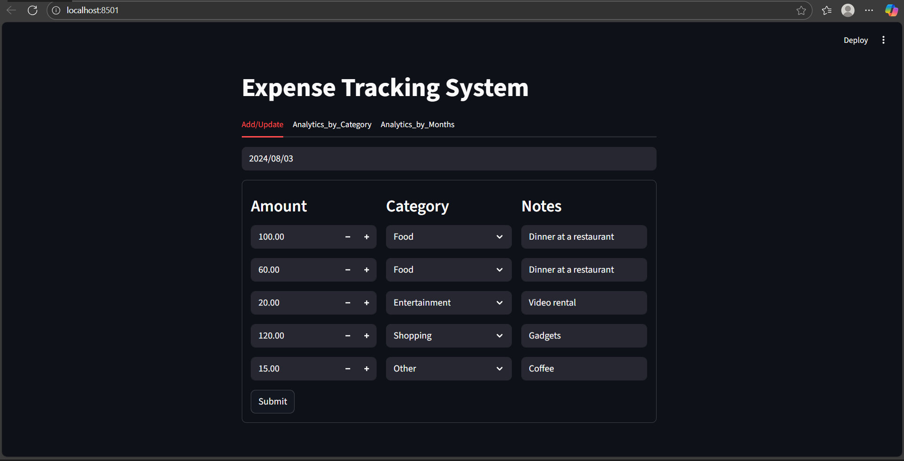
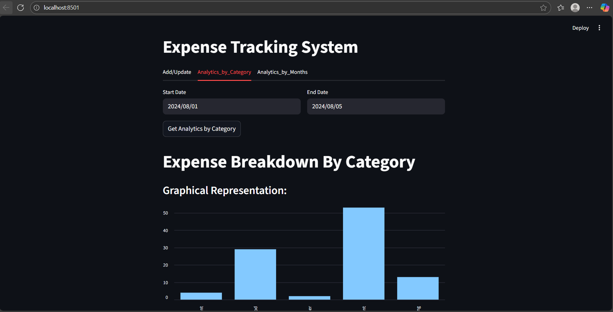
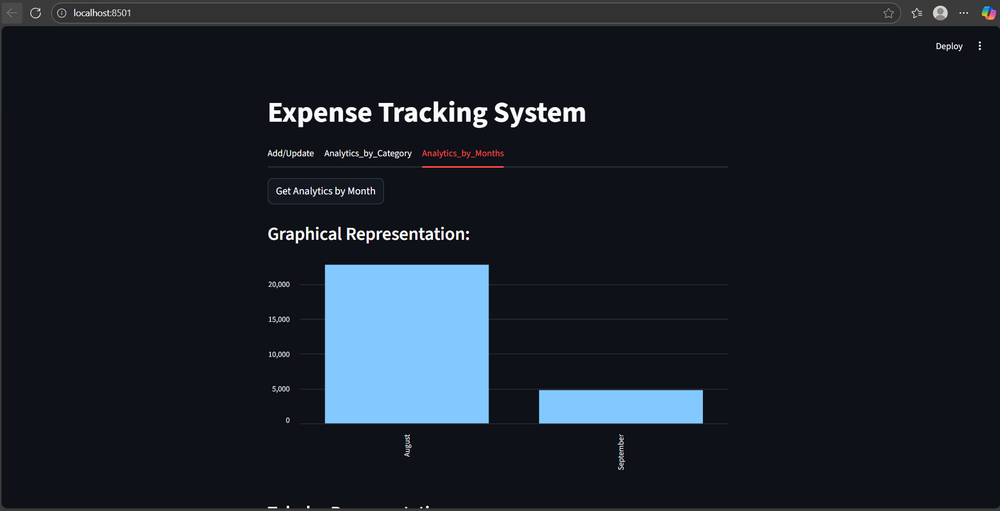

# Expense Management System

This project is an expense management system that consists of a Streamlit frontend application and a FastApi backend server.

## Project Structure 
- **Frontend /**: Contains the Streamlit application code.
- **Backend/**: Contains FastApi backend server code.
- **Tests/**: Contains the test cases for both frontend and backend.
- **Requirements.txt/**: Lists the required Python packages.
- **README.md/**: Provides an overview and instructions for the Project.

## Setup Instructions

1.  **Clone the repository**:
    ```bash
    git clone https://github.com/yourusername/expense-management-system
    cd expense-management-system
    ```
1.  **Install dependencies:**:
    ```commandline
    pip install -r Requirements.txt
    ```
1.  **Run the FastApi server:**:
    ```commandline
    uvicorn server.server:app --reload
    ```
1.  **Run the Streamlit app:**:
    ```commandline
    streamlit run frontend/app.py
    ```
    
## 📸 Project Screenshots  

### 🏠 Add_Update / Overview  


### ➕ Analytics_by_Category  


### 📊 Analytics_by_Month  
 

## Live Demo  
🔗 [Click here to view the app](https://your-live-link.com) 